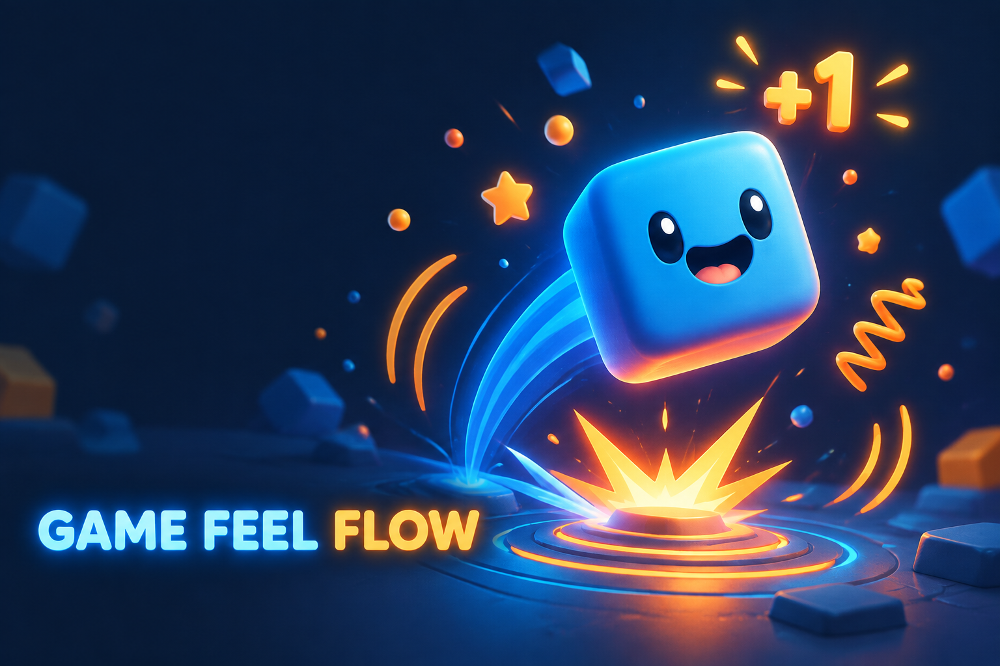
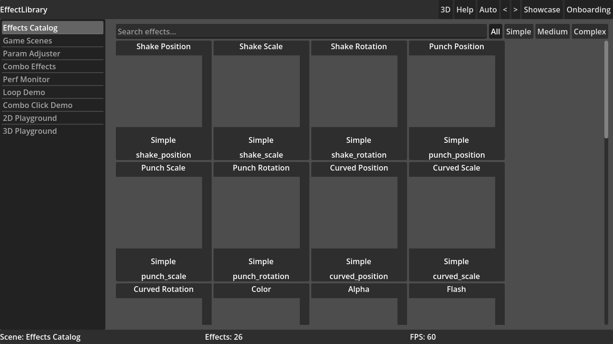
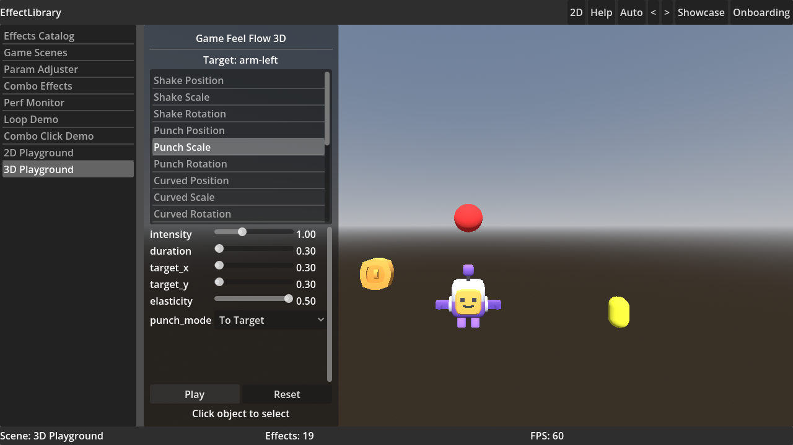

# Game Feel Flow



One-stop game feel (juice) system for **Godot 4.4+** — 77 composable effects, 24 ready-made combos, a dedicated spring family, shakers, a timeline sequencer, channel/event messaging and a full Inspector workflow.

[](https://godotengine.org/)
[](addons/game_feel_flow/LICENSE)

## Install

**Asset Library:** search *Game Feel Flow* in the Godot editor's AssetLib tab.

**Manual:** copy [`addons/game_feel_flow/`](addons/game_feel_flow/) into your project, then enable the plugin in **Project → Project Settings → Plugins**.

## Quick start

```gdscript
GFUtil.hit(self, 2.0)                                        # shortcut API
GameFeelFlow.play("squash_stretch", self)                    # any of 77 effects
GameFeelFlow.play_combo("recipe_hit", self, {"intensity": 2.0})  # any of 24 combos
$GFFPlayer.play("hit")                                       # Inspector-authored combos
$GFFPlayer.preview_effect(my_effect)                         # per-effect preview
```

## What's inside

- **77 registered effects** — transform, springs, rendering/material, camera, audio, physics, lifecycle/logic, UI/text, scene/media
- **24 combos** — 15 classic presets + 9 feel-style recipes (`recipe_hit`, `recipe_death`, `recipe_pickup`, `recipe_camera_hit`, …)
- **Dedicated spring family** — MOVE_TO / PUNCH damped-oscillator springs for 12 property targets
- **Shakers** — smooth-noise, frequency control, directional shake
- **`GFFSequencer`** — timeline sequencer (effects, combos, channels, signals, methods, sounds)
- **Channel system** — decoupled broadcast/receiver feedback
- **Editor tooling** — per-effect ▶ preview buttons, categorized picker, per-type icons
- **Utility nodes** — `GFFPool`, `GFFSoundManager`, `GFFSpringComponent`, `GFFChannelReceiver`

Full feature list, effect catalog and docs: **[addons/game_feel_flow/README.md](addons/game_feel_flow/README.md)**

## Screenshots

| Effects Catalog | 3D Playground |
|---|---|
|  |  |

## Validation

Every subsystem is verified in-engine against a live-node test bench that asserts both *movement* and *full restoration* — springs, shakers, channels, sequencer, recipes, pooling, audio, physics, UI and editor preview paths all green.

## Credits

Built on the MIT-licensed [Game Feel Flow](https://github.com/IndieShade/godot-plugin-game-feel-flow) by IndieShade, extended with a complete feedback-family expansion. Original docs: https://indieshade.github.io/godot-plugin-game-feel-flow/

## License

MIT — see [LICENSE](LICENSE).
